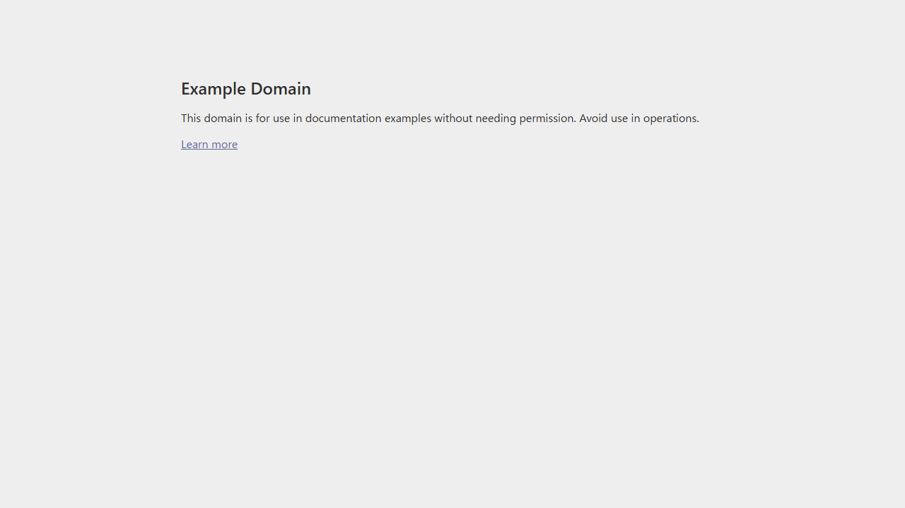
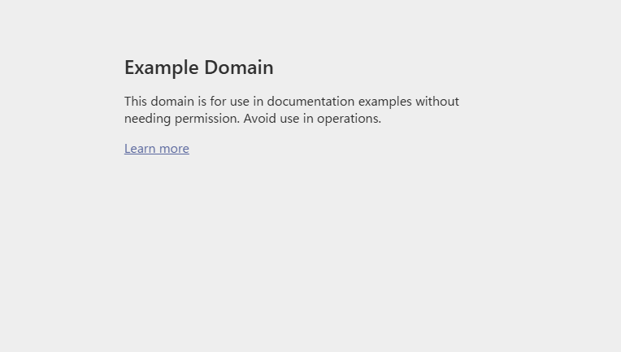
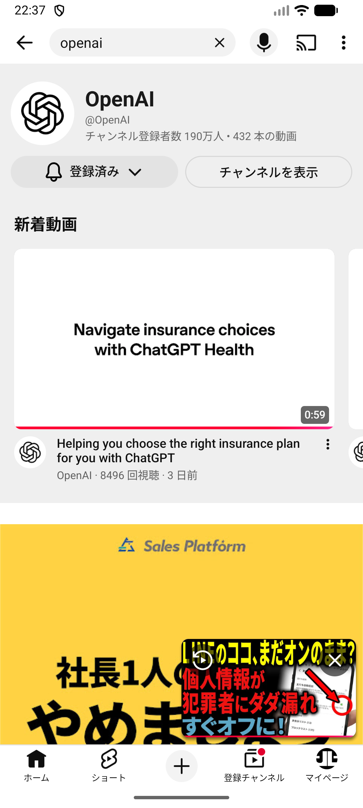
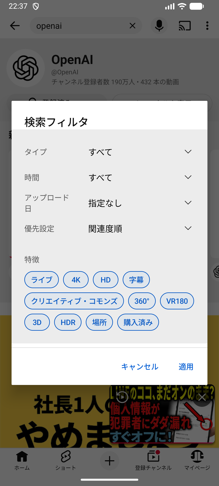
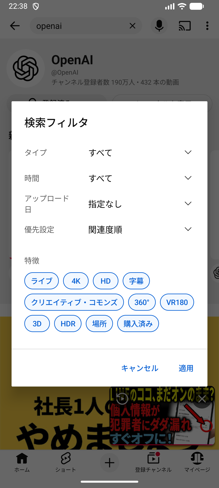
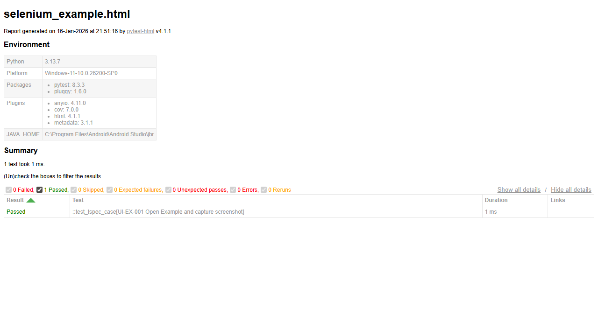
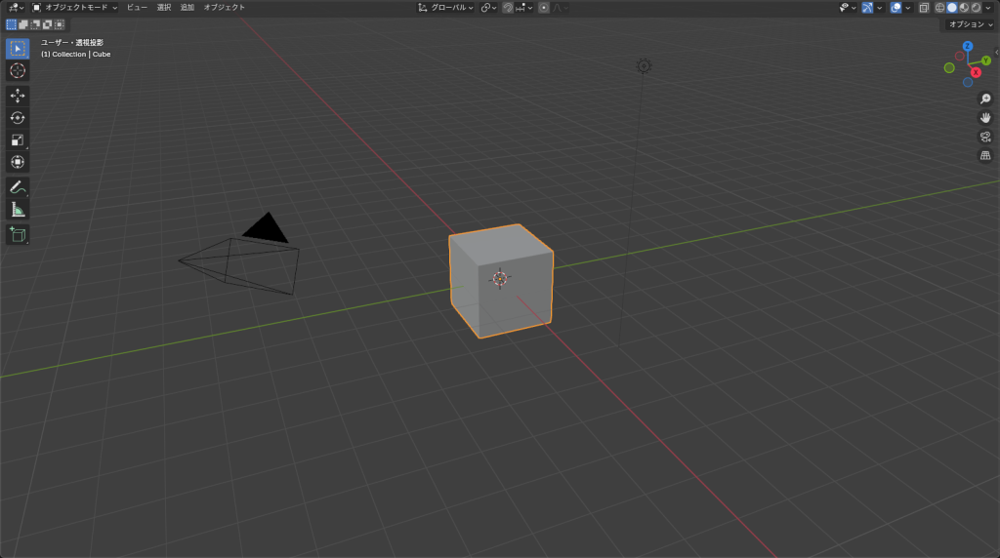
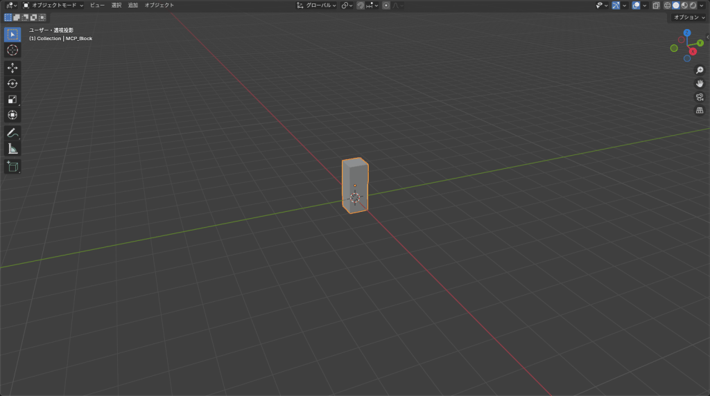

# tspec-runner 1.0.9

TSpec runner for Markdown + `tspec` blocks. Validate, run, and report from the CLI with a single, spec-versioned flow.
JP: TSpec（Markdown + `tspec`）を読み込み、CLI で検証・実行・レポートまで完結する自動化ランナーです。

## Links
- GitHub: https://github.com/jack-low/tspec-runner
- PyPI: https://pypi.org/project/tspec-runner/
JP: リンクは上記です。

## What you can do
- Spec resolution (latest / range / last 3 generations)
- validate / list / run / spec / init / doctor / report
- Simple assertions via `assert.*`
- Unified UI automation API: `ui.*`
  - backends: `selenium` / `appium` (Android/iOS) / `pywinauto` / `agent-browser`
  - install extras only when needed
JP: UI 自動化や各種チェックを軽量コア + extras で提供します。

> Appium (Android/iOS) requires Appium Server + driver setup.
JP: Android/iOS は Appium を前提にしています（別途サーバ・ドライバ設定が必要）。

---

## Quick start (recommended: uv)
```bash
uv venv
uv sync
tspec validate examples/assert_only.tspec.md
tspec run examples/assert_only.tspec.md --report out/report.json
```

Using pip:
```bash
python -m venv .venv
source .venv/bin/activate  # Windows: .venv\Scripts\activate
pip install -U pip
pip install -e ".[dev]"
```
JP: uv が推奨ですが、pip でも同様にセットアップ可能です。

## Basic usage
```bash
tspec spec
tspec init example.tspec.md
tspec validate examples/assert_only.tspec.md --explain-version
tspec run examples/assert_only.tspec.md --report out/report.json
tspec report out/report.json --only-errors --show-steps
```
JP: 基本コマンドの流れは上記です。

## UI run (Selenium)
```bash
tspec run examples/selenium_google.tspec.md --backend selenium --report out/ui.json
```

## UI run (Appium/Android)
```bash
tspec run examples/android_youtube_smoke.tspec.md --backend appium --report out/android_youtube_smoke.json
```
Search flow examples can be fragile; adjust selectors in `examples/android_youtube_search_play.tspec.md` to your environment.
JP: 検索ありサンプルは UI 変更に弱いため、selector を調整してください。

## UI run (agent-browser)
```bash
tspec run examples/agent_browser_smoke.tspec.md --backend agent-browser --report out/agent-browser.json
```

---

## Screenshots
agent-browser smoke:



Selenium (Example Domain):



Appium (YouTube / Android emulator):



Appium search flow (Home -> Search -> Results -> Player):





Report HTML:



> Android/iOS screenshots require Appium Server + device/emulator.
JP: Android/iOS のスクショは Appium + 実機/エミュレータが必要です。

---

## Unity MCP demos
Example: “Create cube -> change material -> move/rotate”.
JP: Cube 作成 → マテリアル変更 → 位置/回転更新の例です。


Actions used:
- `manage_gameobject` create cube
- `manage_material` create + recolor + assign to renderer
- `manage_gameobject` update position/rotation
JP: 実行内容は上記の通りです。

Extra demo: create a sphere, apply material, then create a prefab.
JP: Sphere 作成 → マテリアル適用 → Prefab 化の例です。


Actions used:
- `manage_gameobject` create sphere
- `manage_material` recolor + assign
- `manage_prefabs` create prefab
JP: 実行内容は上記の通りです。

Update guide: `docs/demo_assets.md`
JP: デモ更新手順は `docs/demo_assets.md` にまとめています。

## Blender MCP demos
Viewport screenshot example.
JP: ビューポートのスクリーンショット取得例です。



Modeling flow demo (create objects -> bevel/subdivision -> material -> transform).
JP: オブジェクト生成 → Bevel/Subdivision → マテリアル → 位置/回転変更の流れです。



Update guide: `docs/demo_assets.md`
JP: デモ更新手順は `docs/demo_assets.md` にまとめています。

---

## UI backends (extras)
### Selenium
```bash
pip install -e ".[selenium]"
```

### Appium (Android/iOS)
```bash
pip install -e ".[appium]"
```

### pywinauto (Windows GUI)
```bash
pip install -e ".[pywinauto]"
```

### agent-browser (lightweight headless)
```bash
npm install -g agent-browser
agent-browser install
```
If install fails on Windows, run the exe directly:
```powershell
& "$env:APPDATA\npm\node_modules\agent-browser\bin\agent-browser-win32-x64.exe" install
```
JP: Windows で install が失敗する場合は exe 直接実行で回避できます。

---

## Optional config: tspec.toml
Load with `--config tspec.toml`.
JP: `--config` で読み込みます。

```toml
[ui]
backend = "selenium"  # selenium|appium|pywinauto|agent-browser
headless = true
implicit_wait_ms = 2000

[selenium]
browser = "chrome"  # chrome|firefox
driver_path = ""    # optional: chromedriver/geckodriver path
browser_binary = "" # optional: custom browser binary
args = ["--lang=ja-JP"]
prefs = { "intl.accept_languages" = "ja-JP" }
download_dir = "artifacts/downloads"
window_size = "1280x720"
auto_wait_ms = 3000
page_load_timeout_ms = 30000
script_timeout_ms = 30000

[agent_browser]
binary = "agent-browser"
timeout_ms = 30000
poll_ms = 250
extra_args = []
wsl_fallback = false
wsl_distro = ""
wsl_workdir = ""
```

---

## Common `ui.*` actions
- `ui.open` with `{url}` (Selenium / agent-browser)
- `ui.open_app` with `{caps, server_url}` (Appium)
- `ui.click` with `{selector}`
- `ui.type` with `{selector, text}`
- `ui.wait_for` with `{selector, text_contains?}`
- `ui.get_text` with `{selector}` + `save: "name"`
- `ui.screenshot` with `{path}`
- `ui.close`

> Selector syntax depends on backend (Selenium uses CSS by default; `css=`, `xpath=`, `id=`, etc. are supported).
JP: selector は backend ごとに解釈されます。

---

## Neko (m1k1o/neko) MCP integration
Use `neko.*` tools to call Neko REST API from the MCP server.
JP: MCP Server で `neko.*` を使い、Neko の REST API を操作できます。

Setup:
- `pip install -e ".[mcp,neko]"`
- env vars:
  - `NEKO_BASE_URL` (e.g. `http://localhost:8080`)
  - `NEKO_ALLOWLIST_HOSTS` (e.g. `localhost,localhost:8080`)
  - optional: `NEKO_AUTH_MODE`, `NEKO_USERNAME`, `NEKO_PASSWORD`, `NEKO_BEARER_TOKEN`

Run:
```bash
tspec mcp --transport stdio --workdir .
```

Details: `docs/neko_mcp.md`

---

## Blender / Unity MCP integration
We provide tools that call Blender/Unity MCP endpoints.
JP: Blender/Unity MCP に接続するツールを提供しています。

Blender:
- `pip install -e ".[mcp,blender]"`
- env vars:
  - `BLENDER_MCP_BASE_URL` (e.g. `http://localhost:7300`)
  - `BLENDER_MCP_ALLOWLIST_HOSTS` (recommended: `localhost,localhost:7300`)
  - optional: `BLENDER_MCP_AUTH_MODE` (`none` / `bearer` / `token`)
  - optional: `BLENDER_MCP_BEARER_TOKEN`, `BLENDER_MCP_TOKEN_QUERY`
  - note: blender-mcp (ahujasid) is stdio; not REST compatible
  - CLI: `tspec mcp --blender-mcp-url http://localhost:7300`

Unity:
- `pip install -e ".[mcp,unity]"`
- env vars:
  - `UNITY_MCP_MODE=mcp-http`
  - `UNITY_MCP_MCP_URL` (e.g. `http://localhost:8080/mcp`)
  - `UNITY_MCP_ALLOWLIST_HOSTS` (recommended: `localhost,localhost:8080`)
  - optional: `UNITY_MCP_AUTH_MODE` (`none` / `bearer` / `token`)
  - optional: `UNITY_MCP_BEARER_TOKEN`, `UNITY_MCP_TOKEN_QUERY`
  - REST compatibility: `UNITY_MCP_BASE_URL`
  - CLI: `tspec mcp --unity-mcp-url http://localhost:8080/mcp`

Run:
```bash
tspec mcp --transport stdio --workdir .
```

Details: `docs/blender_mcp.md`, `docs/unity_mcp.md`

---

## Report view
```bash
tspec report out/report.json
tspec report out/report.json --only-errors --show-steps
tspec report out/report.json --case UI-001 --show-steps
tspec report out/report.json --grep google --status failed --status error
```

Long messages (stacktraces):
```bash
tspec report out/report.json --only-errors --show-steps --full-trace --max-message-len 0
```

---

## Failure forensics (auto capture)
When `ui.wait_for` fails, the following are saved under `artifacts/forensics/` by default:
- screenshot (PNG)
- current_url (shown in message)
- page_source (HTML, Selenium only)
JP: `ui.wait_for` 失敗時は自動で鑑識セットを保存します。

---

## MCP (AI integration)
Start `tspec` as an MCP server and call tools from AI clients.
JP: MCP Server として起動し、AI クライアントからツール呼び出しできます。

```bash
pip install -e ".[mcp]"
tspec mcp --transport stdio --workdir .
```

Manual (EN/JP): `tspec manual show mcp-env --full --lang en` / `tspec manual show mcp-env --full --lang jp`

---

## TSPEC-Z1 (compressed handoff)
CLI:
```bash
tspec z1-decode docs/selenium_spec.tspecz1 --format text
tspec z1-decode docs/selenium_spec.tspecz1 --format json
tspec z1-decompile docs/selenium_spec.tspecz1 --format text
tspec z1-decompile docs/selenium_spec.tspecz1 --format yaml
```
JP: TSPEC-Z1 の展開・デコードは上記コマンドを利用します。


## JP (original)
# tspec-runner 1.0.8

TSpec（Markdown + `tspec`）を読み込み、CLI で検証・実行・レポートまで完結する自動化ランナーです。
Markdown の中にある `tspec` ブロックを読み取り、同じ手順を複数環境で再現できます。

## リンク
- GitHub: https://github.com/jack-low/tspec-runner
- PyPI: https://pypi.org/project/tspec-runner/

## できること
- Spec バージョン解決（無指定＝最新 / 範囲指定 / 3世代前まで）
- validate / list / run / spec / init / doctor / report
- `assert.*` による簡易テスト
- **UI 自動化インターフェース（統一 API）**：`ui.*`
  - backend: `selenium` / `appium`(Android/iOS) / `pywinauto` / `agent-browser`
  - 依存は extras で追加（軽いコア）

> Android/iOS は Appium を前提にしています（Appium Server + driver は別途セットアップ）。

---

## クイックスタート（推奨: uv）
```bash
uv venv
uv sync
tspec validate examples/assert_only.tspec.md
tspec run examples/assert_only.tspec.md --report out/report.json
```

pip を使う場合:
```bash
python -m venv .venv
source .venv/bin/activate  # Windows: .venv\Scripts\activate
pip install -U pip
pip install -e ".[dev]"
```

## 使い方（基本）
```bash
tspec spec
tspec init example.tspec.md
tspec validate examples/assert_only.tspec.md --explain-version
tspec run examples/assert_only.tspec.md --report out/report.json
tspec report out/report.json --only-errors --show-steps
```

## UI 実行（例：Selenium）
```bash
tspec run examples/selenium_google.tspec.md --backend selenium --report out/ui.json
```

## UI 実行（例：Appium/Android）
```bash
tspec run examples/android_youtube_smoke.tspec.md --backend appium --report out/android_youtube_smoke.json
```
検索ありのサンプルは YouTube UI 変更の影響を受けやすいので、`examples/android_youtube_search_play.tspec.md` の selector を環境に合わせて調整してください。

## UI 実行（例：agent-browser）
```bash
tspec run examples/agent_browser_smoke.tspec.md --backend agent-browser --report out/agent-browser.json
```

---

## 画面キャプチャ（実行例）
agent-browser による smoke 実行のスクリーンショット:


Selenium（Example Domain）のスクリーンショット:


Appium（YouTube / Androidエミュレータ）のスクリーンショット:


Appium 検索フロー（Home -> Search -> Results -> Player）:


レポート HTML のスクリーンショット:


> Android/iOS のスクリーンショットは Appium Server と実機/エミュレータが必要です。

---

## Unity MCP 操作デモ
Unity MCP で「Cube 作成 → マテリアル変更 → 位置/回転変更」を実行した例です。
操作の流れが追えるように、キャプチャをアニメーションにしています。


実行した内容:
- `manage_gameobject` で Cube 作成
- `manage_material` でマテリアル作成 + 色変更 + Renderer へ割当
- `manage_gameobject` で位置/回転を更新

追加デモ: Sphere を作成してマテリアルを適用し、Prefab 化する流れです。


実行した内容:
- `manage_gameobject` で Sphere 作成
- `manage_material` で色付きマテリアル作成 + Renderer へ割当
- `manage_prefabs` で Prefab を作成

## Blender MCP 操作デモ
Blender MCP でビューポートのスクリーンショットを取得した例です。


追加デモ: モデリング操作の流れ（オブジェクト生成 → Bevel/Subdivision → マテリアル付与 → 位置/回転変更）です。


---

## UI backend を使う場合（extras）
### Selenium
```bash
pip install -e ".[selenium]"
```

### Appium（Android/iOS）
```bash
pip install -e ".[appium]"
```

### pywinauto（Windows GUI）
```bash
pip install -e ".[pywinauto]"
```

### agent-browser（軽量 headless）
```bash
npm install -g agent-browser
agent-browser install
```
Windows で install が失敗する場合は exe を直接実行する：
```powershell
& "$env:APPDATA\\npm\\node_modules\\agent-browser\\bin\\agent-browser-win32-x64.exe" install
```

---

## 設定（任意）: tspec.toml
`--config tspec.toml` で読み込みます。最小例：

```toml
[ui]
backend = "selenium"  # selenium|appium|pywinauto|agent-browser
headless = true
implicit_wait_ms = 2000

[selenium]
browser = "chrome"  # chrome|firefox
driver_path = ""    # optional: chromedriver/geckodriver path
browser_binary = "" # optional: custom browser binary
args = ["--lang=ja-JP"]
prefs = { "intl.accept_languages" = "ja-JP" }
download_dir = "artifacts/downloads"
window_size = "1280x720"
auto_wait_ms = 3000
page_load_timeout_ms = 30000
script_timeout_ms = 30000

[agent_browser]
binary = "agent-browser"
timeout_ms = 30000
poll_ms = 250
extra_args = []
wsl_fallback = false
wsl_distro = ""
wsl_workdir = ""
```

---

## `ui.*` の主なアクション
- `ui.open` with `{url}` （Selenium / agent-browser）
- `ui.open_app` with `{caps, server_url}` （Appium）
- `ui.click` with `{selector}`
- `ui.type` with `{selector, text}`
- `ui.wait_for` with `{selector, text_contains?}`
- `ui.get_text` with `{selector}` + `save: "name"`
- `ui.screenshot` with `{path}`
- `ui.close`

> selector は backend ごとに解釈されます（Seleniumは CSS を基本、`css=`/`xpath=`/`id=`/`name=`/`link=` などのprefixも可）。

---

## Neko (m1k1o/neko) MCP 連携
MCP Server で `neko.*` を有効化し、Neko の REST API をツールとして使えます。

準備:
- `pip install -e ".[mcp,neko]"`
- 環境変数を設定:
  - `NEKO_BASE_URL`（例: `http://localhost:8080`）
  - `NEKO_ALLOWLIST_HOSTS`（例: `localhost,localhost:8080`）
  - 任意: `NEKO_AUTH_MODE`, `NEKO_USERNAME`, `NEKO_PASSWORD`, `NEKO_BEARER_TOKEN`

起動:
```bash
tspec mcp --transport stdio --workdir .
```

詳細: `docs/neko_mcp.md`

---

## Blender / Unity MCP 連携
Blender / Unity の MCP サーバと連携するツールを追加しました。
Unity MCP は `/health` と `/mcp` (Streamable HTTP) を前提にしています。

Blender:
- `pip install -e ".[mcp,blender]"`
- 環境変数:
  - `BLENDER_MCP_BASE_URL`（例: `http://localhost:7300`）
  - `BLENDER_MCP_ALLOWLIST_HOSTS`（推奨: `localhost,localhost:7300`）
  - 任意: `BLENDER_MCP_AUTH_MODE` (`none` / `bearer` / `token`)
  - 任意: `BLENDER_MCP_BEARER_TOKEN`, `BLENDER_MCP_TOKEN_QUERY`
  - 備考: blender-mcp (ahujasid) は stdio のため REST 互換ではありません

Unity:
- `pip install -e ".[mcp,unity]"`
- 環境変数:
  - `UNITY_MCP_MODE=mcp-http`
  - `UNITY_MCP_MCP_URL`（例: `http://localhost:8080/mcp`）
  - `UNITY_MCP_ALLOWLIST_HOSTS`（推奨: `localhost,localhost:8080`）
  - 任意: `UNITY_MCP_AUTH_MODE` (`none` / `bearer` / `token`)
  - 任意: `UNITY_MCP_BEARER_TOKEN`, `UNITY_MCP_TOKEN_QUERY`
  - REST 互換モード: `UNITY_MCP_BASE_URL` を指定

起動:
```bash
tspec mcp --transport stdio --workdir .
```

詳細: `docs/blender_mcp.md`, `docs/unity_mcp.md`

---

## レポート表示
```bash
tspec report out/report.json
tspec report out/report.json --only-errors --show-steps
tspec report out/report.json --case UI-001 --show-steps
tspec report out/report.json --grep google --status failed --status error
```

### メッセージが長い場合（Stacktrace等）
```bash
tspec report out/report.json --only-errors --show-steps --full-trace --max-message-len 0
```

---

## 失敗時の鑑識セット（自動採取）
- `ui.wait_for` が失敗すると、既定で以下を `artifacts/forensics/` に保存します：
  - screenshot（PNG）
  - current_url（メッセージに表示）
  - page_source（HTML, Seleniumのみ）

---

## MCP (AI連携)
MCP Server として起動し、AIクライアントから TSpec をツール呼び出しできます。

```bash
pip install -e ".[mcp]"
tspec mcp --transport stdio --workdir .
```

マニュアル: `tspec manual show mcp-env --full --lang jp`

---

## TSPEC-Z1 圧縮（AI引き渡し用）
CLI:
```bash
tspec z1-decode docs/selenium_spec.tspecz1 --format text
tspec z1-decode docs/selenium_spec.tspecz1 --format json
tspec z1-decompile docs/selenium_spec.tspecz1 --format text
tspec z1-decompile docs/selenium_spec.tspecz1 --format yaml
```

---

## Pytest reporting (pytest / pytest-html)
Install:
```bash
uv pip install -e ".[report]"
```

Generate during run:
```bash
tspec run examples/android_login.tspec.md --backend appium --report out/android.json --pytest-html out/android.html --pytest-junitxml out/android.xml
```

Generate from existing JSON:
```bash
tspec pytest-report out/android.json --html out/android.html
```

---

## Update helper (PowerShell)
```powershell
# extract the update script from installed package (optional)
tspec asset update.ps1 --to .

# apply a downloaded zip into current repo
.\scripts\update.ps1 -ZipPath "$HOME\Downloads\tspec-runner-<version>.zip" -RepoDir .
```
